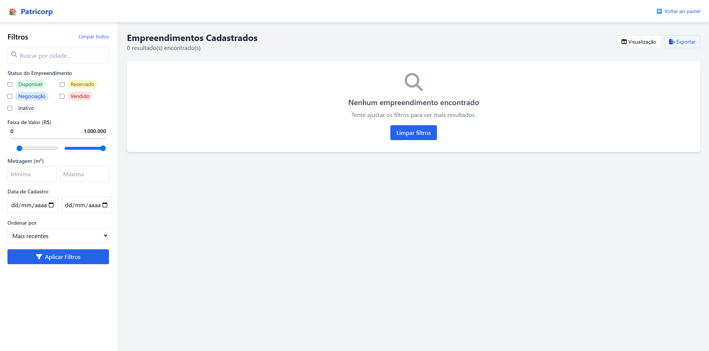
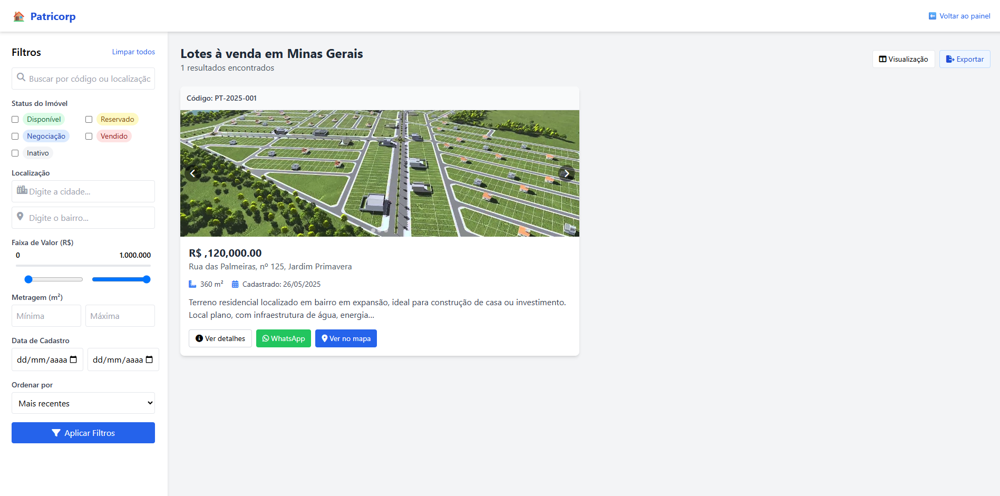
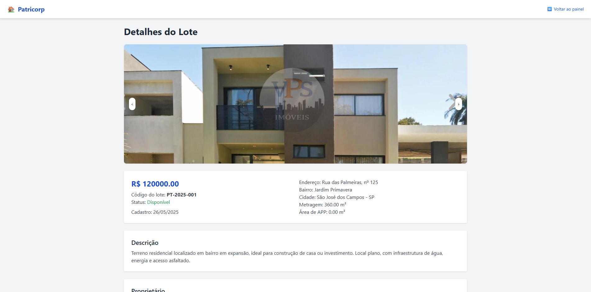
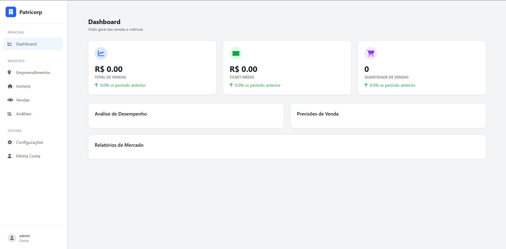
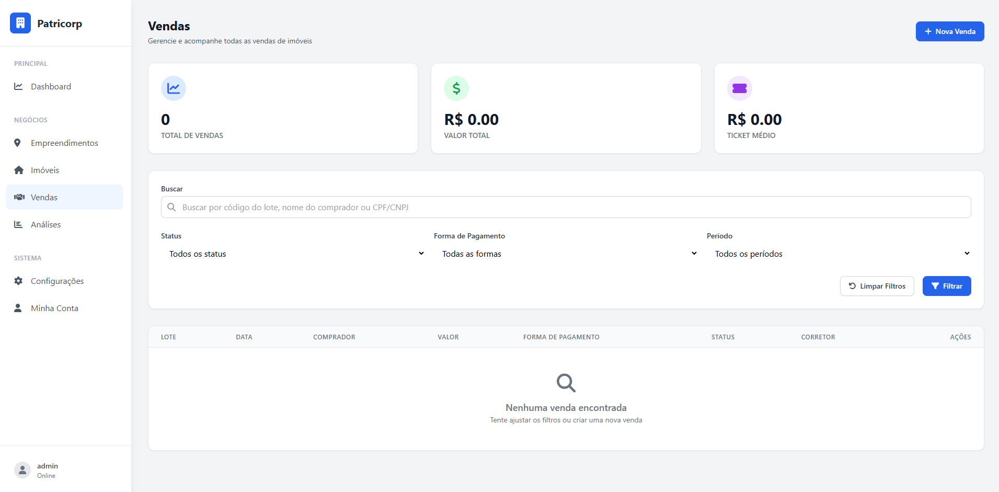

# 🏘️ Real Estate CRM Platform

A full-featured CRM solution built for real estate professionals and agencies. This web-based system streamlines the management of developments, individual properties, and sales workflows — with distinct access levels for administrators and consultants.

---

## 🚀 Tech Stack

`Django` · `Python` · `JavaScript` · `PostgreSQL` · `HTML/CSS`

---

## 🔧 Core Functionalities

✅ **Role-based Access**  
- Consultants access listings tailored to their work.  
- Admins manage the platform through a full-featured dashboard.

🏢 **Development Management**  
- Register and monitor multiple developments with unit-level status: available, sold, or reserved.

📄 **Property & Sales Management**  
- View and edit property details, availability, pricing, and registration history.  
- Sales records accessible to authorized users only.

🔐 **Authentication & Routing**  
- Secure login with automatic redirection based on user type.

🕵️ **Recent Updates & Insights**  
- Track the latest property or development updates in real-time.

---

## 🖼️ Screenshots

> All screens are from a working prototype and reflect a real-world SaaS CRM use case.

## 🖼️ Screenshots

> The following images illustrate the key features and UI of the Real Estate CRM Platform.

### 🔐 Admin Login  

### 🧭 Admin Dashboard  

### 🏘️ Developments Overview  

### 🏗️ Lot List  

### 📄 Lot Detail View  

### 🧑 Consultant Dashboard  

### 💰 Sales View (Admin Only)  

## 📌 Notes

This is a demo repository for portfolio purposes.  
Feel free to reach out to discuss the system architecture or features in more detail.

---

## 🤝 Contact

  
  

---

*Let’s build something amazing together. Available for freelance and remote opportunities.*
